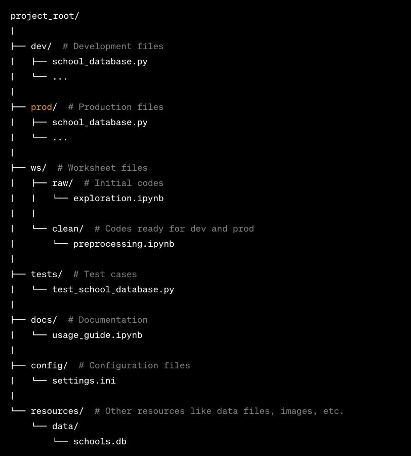

# StudentDatabase Project

## Introduction
This project is designed to manage and query a database of student records. It uses SQLite for database operations and provides a Python interface for interacting with the database.

## Features
- Load student data from CSV files into an SQLite database.
- Query the database for specific student information.
- Generate reports based on student performance and demographics.

## Installation
To install the necessary dependencies for this project, run the following command:

```bash
pip install -r requirements.txt
```

## Project Structure

The `StudentDatabase` project is organized into several directories, each serving a distinct role in the development lifecycle:

- `dev/`: This directory contains the development versions of the Python scripts, where new features and testing occur.

- `prod/`: The production directory holds the finalized versions of the scripts that are ready for deployment.

- `ws/`: The worksheet directory is split into two subdirectories:
  - `raw/`: Here, initial exploratory codes and notebooks such as `exploration.ipynb` are stored.
  - `clean/`: Contains refined code that is prepared for transition into the development and production stages, exemplified by `preprocessing.ipynb`.

- `tests/`: This directory is dedicated to test cases, ensuring that the code maintains its integrity through changes, with files like `test_school_database.py`.

- `docs/`: Documentation related to the project, including how to use the scripts and systems, can be found here, such as in `usage_guide.ipynb`.

- `config/`: Configuration files like `settings.ini` that store environment and setup parameters reside in this directory.

- `resources/`: A place for additional project resources, including data files, images, etc. For instance, the SQLite database file `schools.db` is located within the `data/` subdirectory.

This structure is designed to maintain a clean and efficient workflow, from development to production, ensuring that each aspect of the project is easy to locate and manage.


